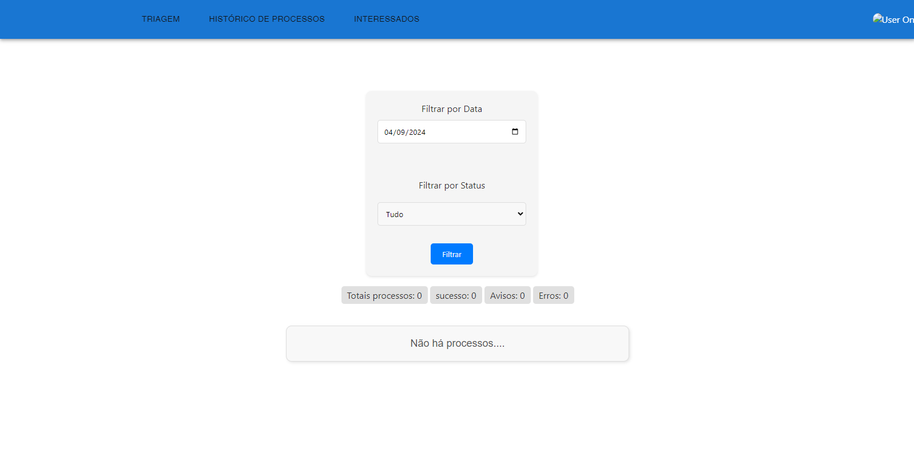

# Frontend - Super Pica-Pau

## Descrição
O frontend do projeto **Super Pica-Pau** é uma aplicação web construída com **React**, que faz requisições para o backend e o serviço de controle de usuário. Ele utiliza **Axios** para gerenciar essas requisições, e a interface é feita com **JavaScript** e **CSS**. O projeto está configurado para rodar na porta **8082**.

## Tecnologias Utilizadas
- **React** (com React Router e DOM)
- **Axios** (para requisições HTTP)
- **JavaScript** e **CSS**
- **Docker** (para containerização)

<details>
  <summary><big>Screenshots </big></summary>
  Login Pica-Pau
  <br>
  
  <br>
  Login Sapiens
  <br>
  
  <br>
  Tela Inicial
  <br>
  
  <br>
  Histório de processos triados
  <br>
  
  <br>
  Cadastro de envolvidos no processo
  <br>
  
  <br>
</details>

## Instalação
1. Clone o repositório:

   ```bash
   git clone https://github.com/Pace-pfpa/picapau-front-react.git
2. Instale as dependências:

    ```bash
   npm install
## Configuração

1. O arquivo **global.js** contém as URLs do controle de usuário (porta 3010) e do backend (porta 3000). Certifique-se de que esses serviços estejam rodando corretamente.:

    ```bash
   export const controleUser = "http://localhost:3010/"
    export const picapauApiSapiens = "http://localhost:3000/samir/"
2. Preencha as variáveis de ambiente necessárias no arquivo .env.

## Rodando o Projeto
### Com npm:
* Inicie o servidor localmente: 
    ```bash
    npm run serve
### Com Docker Compose
* Suba o ambiente usando Docker Compose:
    ```bash
    docker-compose up -d --build
## Contribuição
Atualmente, a contribuição é restrita a membros da equipe pica-pau na organização Nutec-PFPA no GitHub.
